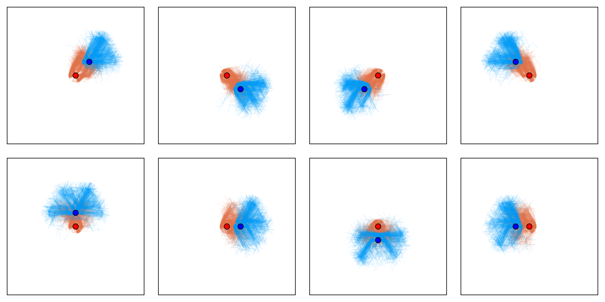

# MarkovGames.jl

This package provides a core interface for working with Markov games (MGs) and partially observable Markov games (POMGs).


The functionality is designed to be very similar to [POMDPs.jl](https://github.com/JuliaPOMDP/POMDPs.jl).




An example of a continuous tag POMG used in the paper [Bridging the Gap between Partially Observable Stochastic Games and Sparse POMDP Methods](https://arxiv.org/abs/2405.18703) is given below:


```julia
using StaticArrays
using Distributions
using POMDPs
using POMDPTools
using MarkovGames

const Vec2{T} = SVector{2, T}
const Vec8 = SVector{8, Float64}

#player 1 is pursuer -- player 2 is evader

struct CTagState{T}
    pursuer::Vec2{T}
    evader::Vec2{T}
end

struct CTagBearingObs
    n::Int
    θ::Float64
    CTagBearingObs(n,θ=0.0) = new(n,θ)
end

function (obsmodel::CTagBearingObs)(θ)
    subdiv = 2π / obsmodel.n
    θrot = mod2pi(θ - obsmodel.θ)
    return Int(div(θrot, subdiv))
end

Base.@kwdef struct ContinuousTag{T,O<:Tuple} <: POMG{CTagState{T}, Tuple{Int,Int}, Tuple{Int, Int}}
    tag_radius::Float64                         = 0.1
    observations::O                             = (CTagBearingObs(4), CTagBearingObs(4))
    n_act::Int                                  = 4
    step_sizes::Tuple{Float64, Float64}         = (0.1, 0.1)
    initialstate_dims::Tuple{Float64, Float64}  = (0.25, 0.25)
    discount::Float64                           = 0.95
    dtype::Type{T}                              = Float32
    dense_reward::Bool                          = false
    transition_noise::Float64                   = 0.1
end

MarkovGames.discount(pomg::ContinuousTag) = pomg.discount
MarkovGames.actions(pomg::ContinuousTag) = (1:pomg.n_act, 1:pomg.n_act)
MarkovGames.observations(pomg::ContinuousTag) = (0:pomg.n_obs-1, 0:pomg.n_obs-1)

function MarkovGames.initialstate(pomg::ContinuousTag{T}) where T
    dims = T.(pomg.initialstate_dims)
    return ImplicitDistribution() do rng
        s1 = (@SArray(rand(rng, T, 2)) .* 2 .- 1) .* dims
        s2 = (@SArray(rand(rng, T, 2)) .* 2 .- 1) .* dims
        CTagState{T}(s1, s2)
    end
end

function MarkovGames.observation(pomg::ContinuousTag, sp::CTagState)
    Δx = sp.evader - sp.pursuer
    θp = mod2pi(atan(Δx[2], Δx[1]))
    θe = mod2pi(θp + π)
    return ProductDistribution(
        Deterministic(pomg.observations[1](θp)), Deterministic(pomg.observations[2](θe))
    )
end

ctag_move(s::Vec2{T}, θ, ds) where T = SA[s[1] + T(ds*cos(θ)), s[2] + T(ds*sin(θ))]

function MarkovGames.gen(pomg::ContinuousTag, s::CTagState{T}, a::Tuple{Int, Int}, rng::Random.AbstractRNG=Random.default_rng()) where T
    subdiv = 2π / pomg.n_act
    θs = a .* subdiv
    θs = map(θs) do θ
        rand(rng, Normal(θ, pomg.transition_noise))
    end
    sp = CTagState{T}(
        ctag_move(s.pursuer, θs[1], pomg.step_sizes[1]),
        ctag_move(s.evader, θs[2], pomg.step_sizes[2]),
    )
    return (;sp)
end

function dense_pursuer_reward(pomg::ContinuousTag, s::CTagState, a)
    Δx = s.evader - s.pursuer
    return norm(Δx, 2)/pomg.tag_radius
end

function sparse_pursuer_reward(pomg::ContinuousTag, s::CTagState, a)
    Δx = s.evader - s.pursuer
    return norm(Δx, 2) ≤ pomg.tag_radius ? 1.0 : 0.0
end

function MarkovGames.reward(pomg::ContinuousTag, s::CTagState, a)
    r = pomg.dense_reward ? dense_pursuer_reward(pomg, s, a) : sparse_pursuer_reward(pomg, s, a)
    return (r, -r)
end
```
